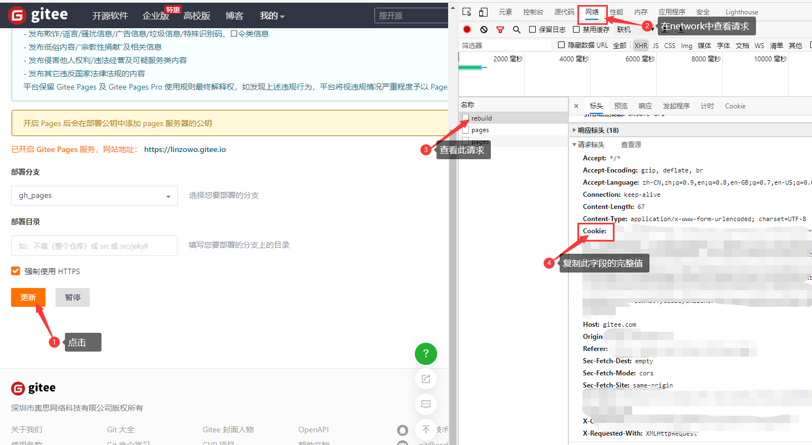

# gitee-pages-action

## 触发后模拟登录然后触发接口

> Auto reload gitee pages

### 例子

> example

```
jobs:
  reload-pages:
    runs-on: ubuntu-latest
    steps:
      - name: reload
        uses: mizuka-wu/gitee-pages-action@v1.0.0
        with:
          repository: your_github_name/repository_name
          cookie: ${{ secrets.GITEE_COOKIE }}
          branch: master
          directory: src
          https: true
```

## 获取cookie

| step_1                                                       | step_2                                                       | step_3                                      |
| ------------------------------------------------------------ | ------------------------------------------------------------ | ------------------------------------------- |
| 进入gitee pages服务管理页，点击更新                          | 打开devTools，在network中查看rebuild请求的标头               | 复制请求标头中的cookie值                    |
| Go to the Gitee Pages service management page and click Update | Open devTools and look at the headers for rebuild requests in the network | Copy the cookie value in the request header |




## 添加 cookie

> How to add Cookie

在`setting`中点击`secrets`，新建`GITEE_COOKIE`，将上面获取到的cookie值存入其中。

> in `setting` Menu, click `secrets` button，add `GITEE_COOKIE`

## 参数

> uses

参数和 gitee 刷新页面一一对应

> this attributes is One-to-one correspondence to the refresh page

<table>
  <thead>
    <tr>
      <th>参数名/input</th>
      <th>必填/isrequired</th>
      <th>默认值/default value</th>
      <th>参考/example</th>
    </tr>
  </thead>
  <tbody>
    <tr>
      <td>repository</td>
      <td>是/yes</td>
      <td>null</td>
      <td>mizuka-wu/mizuka-wu.github.io</td>
    </tr>
    <tr>
      <td>cookie</td>
      <td>是/yes</td>
      <td>null</td>
      <td>Hm_lpvt_24f17767262929947cc3631f99bfd274=1582869665;</td>
    </tr>
    <tr>
      <td>branch</td>
      <td>否/false</td>
      <td>master</td>
      <td>master</td>
    </tr>
    <tr>
      <td>directory</td>
      <td>否/false</td>
      <td></td>
      <td>src</td>
    </tr>
    <tr>
      <td>https</td>
      <td>否/false</td>
      <td>true</td>
      <td>true</td>
    </tr>
  </tbody>
</table>
